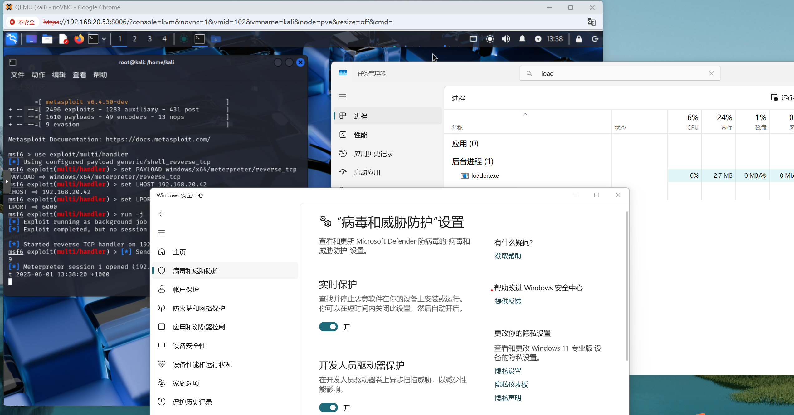
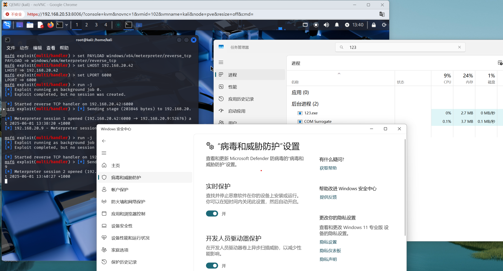

# 🛡️ 2025.5.31 – Kali + msfvenom Bypass for Windows 11 Defender  
**使用 Kali + msfvenom 绕过 Windows 11 Defender（适用于 Windows 11）**

---

This repository demonstrates how to generate a Windows 11-compatible payload using `msfvenom`,  
and execute it using two custom C loaders (`loader.c` and `loader_for_123.c`).

> 📌 **Tested:** ✅ Windows 11  
> ❌ **Not working:** Windows 10

本项目展示如何使用 `msfvenom` 生成适用于 Windows 11 的免杀载荷，  
并通过两个自定义 C loader（`loader.c` 和 `loader_for_123.c`）实现执行。

> 📌 **测试平台：** ✅ Windows 11  
> ❌ **不支持：** Windows 10

---

## ⚠️ WARNING / 警告

**`loader_for_123.c` includes persistence and is NOT safe to run on your main machine.**  
**Only run it in an isolated Windows 11 virtual machine.**

> **`loader_for_123.c` 包含持久化功能，不可在主机上运行。**  
> 请仅在虚拟 Windows 11 环境中测试。

Persistence behavior:
- 📂 Copies itself to:  
  `%APPDATA%\Microsoft\Windows\Start Menu\Programs\Startup\123.exe`
- 🧾 Adds registry key:  
  `HKEY_CURRENT_USER\Software\Microsoft\Windows\CurrentVersion\Run`

持久化行为：
- 📂 拷贝自身至：  
  `%APPDATA%\Microsoft\Windows\Start Menu\Programs\Startup\123.exe`
- 🧾 添加注册表启动项：  
  `HKEY_CURRENT_USER\Software\Microsoft\Windows\CurrentVersion\Run`

🧹 **Manual cleanup required after testing!**

🧹 **测试结束后请手动清理！**

---

## 🧪 `loader.c` – Basic Loader (No Persistence)  
### `loader.c` – 基础加载器（无持久化）

- In-memory shellcode execution only  
- XOR-decrypts payload at runtime (`key = 0x5C`)  
- Safe to use for local shellcode testing  
- No file copy, no registry, no persistence

- 执行纯内存 shellcode  
- 运行时进行 XOR 解密（key = 0x5C）  
- 可在本机安全测试  
- 无文件拷贝、无注册表写入、无持久化行为

---

## 📷 Screenshots

### `loader_for_123.c` demo

### `loader.c` demo

## 📌 Disclaimer / 免责声明

This project is intended solely for educational and security research purposes.

- Do not use this code, or any derived executables, on unauthorized systems.
- The author is not responsible for any illegal use or damage caused.
- Always test in isolated virtual environments only.
- By using this code, you agree to comply with all applicable laws and ethical guidelines.

本项目仅用于网络安全教育和研究目的。

- 请勿将本代码或其生成的程序用于任何未经授权的系统。
- 作者对任何非法用途或由此引发的后果概不负责。
- 所有测试请仅在受控虚拟环境中进行。
- 使用本项目即视为同意遵守相关法律法规及道德规范。

